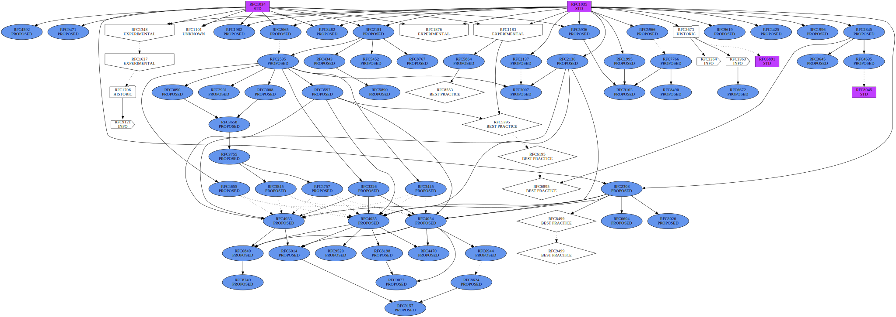

# An RFC browser

You can use the following:

```
rfc-browser RFC1034 RFC1035 > dns.gv
```

Then produce an SVG file with:

```
dot -Tsvg -O dns.gv
```

This will create a `dns.gv.svg` file that you can view in your favorite SVG browser (Inkscape, Firefox...)

It is shown below:



The dotted arrows represent obsoletions while the solid arrows represent updates.
